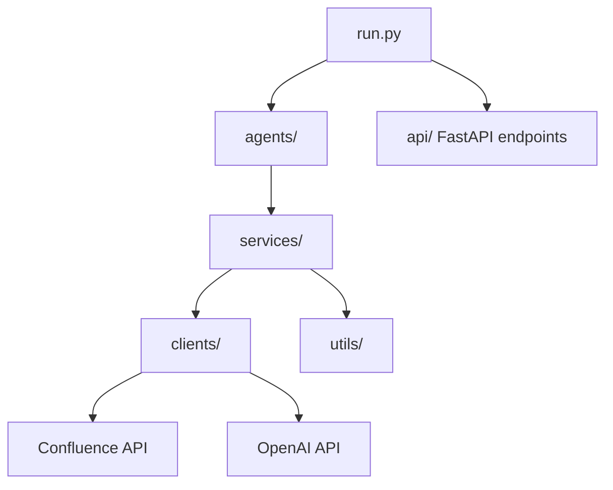
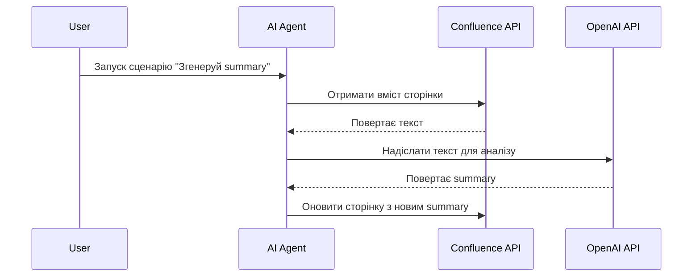

# **README.md (готовий повний блок)**

# Confluence_AI

AI‑агент для інтеграції з Confluence Cloud, який автоматизує читання, аналіз, узагальнення та оновлення сторінок у робочому просторі.  
Проєкт створений для побудови модульної, масштабованої архітектури, що дозволяє підключати зовнішні AI‑сервіси, FastAPI‑ендпоїнти та майбутню інтеграцію з Jira.

---

## 🎯 Мета проєкту

Створити Python‑агента, який:

- читає сторінки Confluence через REST API  
- аналізує контент за допомогою зовнішніх AI‑моделей  
- генерує summary, рекомендації, структури документації  
- оновлює сторінки або створює нові  
- працює з токенами через `.env`  
- має модульну архітектуру для подальшого розширення (Jira, Telegram‑боти, CI/CD)

---

## 🧱 Архітектура проєкту

```
Confluence_AI/
│
├── clients/        # Клієнти для API (Confluence, OpenAI, інші)
├── services/       # Бізнес-логіка, обробка даних, пайплайни
├── agents/         # AI-агенти, які виконують складні сценарії
├── utils/          # Логування, парсинг, допоміжні функції
├── api/            # FastAPI-ендпоїнти (на майбутнє)
├── scripts/        # Скрипти для запуску задач
├── tests/          # Тести
│
├── run.py          # Точка входу для локального запуску
├── settings.py     # Конфігурація, читання .env
├── requirements.txt
├── .env.example
└── README.md
```

---

## 🧩 Mermaid‑діаграма архітектури



---

## 🚀 Use Cases

### **1. Автоматичне створення summary сторінок Confluence**


---

### **2. Автоматичне створення нових сторінок на основі шаблонів**
- AI‑агент отримує дані з Jira/бота/форми  
- Генерує структуру документа  
- Створює сторінку в Confluence  
- Додає теги, заголовки, таблиці, діаграми

---

### **3. Очищення та нормалізація документації**
- Виявлення застарілих сторінок  
- Генерація рекомендацій  
- Автоматичне оновлення форматування  
- Стандартизація структури документа

---

### **4. Інтеграція з Telegram‑ботом (майбутнє)**
- Користувач надсилає команду  
- Агент читає сторінку  
- Генерує відповідь  
- Повертає результат у бот

---

### **5. Автоматичний аудит документації**
- Перевірка наявності ключових розділів  
- Пошук дублікатів  
- Генерація звіту  
- Оновлення Confluence

---

## 🔧 Встановлення

1. Клонувати репозиторій:
   ```bash
   git clone https://github.com/nkfed/Confluence_AI.git
   ```

2. Створити віртуальне середовище:
   ```bash
   python -m venv .venv
   ```

3. Активувати середовище:
   ```bash
   .venv\Scripts\activate
   ```

4. Встановити залежності:
   ```bash
   pip install -r requirements.txt
   ```

---

## 🔐 Налаштування `.env`

Створіть файл `.env` на основі `.env.example`:

```
CONFLUENCE_BASE_URL=
CONFLUENCE_API_TOKEN=
CONFLUENCE_EMAIL=
OPENAI_API_KEY=
```

---

## ▶️ Запуск

```bash
python run.py
```

---

## 👤 Автор

**Микола (nkfed)**  
Висококваліфікований бізнес‑аналітик та технічний лідер, який будує AI‑інтеграції для автоматизації документації та бізнес‑процесів.
```

---

