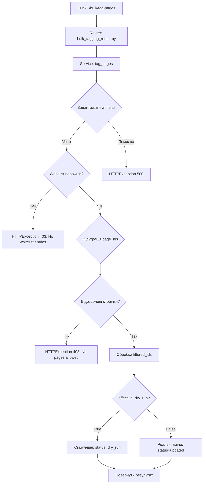

# 🔒 Whitelist механізм для `/bulk/tag-pages` — Технічна документація

## Огляд

Ендпоінт `/bulk/tag-pages` використовує **обов'язковий whitelist-механізм** для контролю доступу до сторінок. Whitelist гарантує, що тільки дозволені сторінки можуть бути оброблені.

---

## 🔷 Архітектура whitelist-інтеграції

### Компоненти:

1. **WhitelistManager** — завантажує дозволені ID з `whitelist_config.json`
2. **BulkTaggingService.tag_pages()** — фільтрує `page_ids` через whitelist
3. **Режимна логіка** — контролює dry_run згідно з `TAGGING_AGENT_MODE`

---

## 🔷 Потік виконання



---

## 🔷 Код інтеграції

### 1. Завантаження whitelist

```python
from src.core.whitelist.whitelist_manager import WhitelistManager

whitelist_manager = WhitelistManager()

try:
    allowed_ids = await whitelist_manager.get_allowed_ids(space_key, self.confluence)
    logger.info(f"[TagPages] Whitelist loaded: {len(allowed_ids)} allowed pages")
    
    if not allowed_ids:
        raise HTTPException(
            status_code=403,
            detail="No whitelist entries for space {space_key}"
        )
except Exception as e:
    raise HTTPException(status_code=500, detail=f"Failed to load whitelist: {e}")
```

---

### 2. Фільтрація page_ids

```python
# Конвертуємо page_ids у int
page_ids_int = [int(pid) for pid in page_ids]

# Фільтруємо через whitelist
filtered_ids = [pid for pid in page_ids_int if pid in allowed_ids]

logger.info(
    f"[TagPages] Whitelist filtering: "
    f"requested={len(page_ids)}, allowed={len(allowed_ids)}, filtered={len(filtered_ids)}"
)

if not filtered_ids:
    raise HTTPException(
        status_code=403,
        detail="No pages allowed by whitelist"
    )
```

---

### 3. Обробка filtered_ids

```python
skipped_due_to_whitelist = len(page_ids) - len(filtered_ids)

# Обробка тільки дозволених сторінок
for page_id_int in filtered_ids:
    page_id = str(page_id_int)
    # ... тегування ...
```

---

## 🔷 Режимна матриця з whitelist

| Режим         | Whitelist | dry_run=true | dry_run=false | Опис                                    |
|---------------|-----------|--------------|---------------|-----------------------------------------|
| **TEST**      | ✅ Так    | Симуляція    | Симуляція (forced) | Завжди dry-run + whitelist фільтрація |
| **SAFE_TEST** | ✅ Так    | Симуляція    | Реальні зміни | dry_run керує записом + whitelist     |
| **PROD**      | ✅ Так    | Симуляція    | Реальні зміни | dry_run керує записом + whitelist     |

**Важливо:** Whitelist застосовується **завжди** незалежно від режиму.

---

## 🔷 Конфігурація whitelist

### Формат `whitelist_config.json`:

```json
{
  "nkfedba": {
    "entry_points": [19699862097, 19729285121],
    "include_children": true
  },
  "other-space": {
    "entry_points": [12345678],
    "include_children": false
  }
}
```

### Параметри:

| Параметр           | Тип            | Опис                                              |
|--------------------|----------------|---------------------------------------------------|
| `entry_points`     | `List[int]`    | Список ID кореневих сторінок (entry points)       |
| `include_children` | `bool`         | Чи включати дочірні сторінки рекурсивно (default: `true`) |

---

## 🔷 WhitelistManager API

### Метод: `get_allowed_ids(space_key, confluence_client)`

**Опис:** Завантажує дозволені ID сторінок для простору.

**Параметри:**
- `space_key` (str) — ключ Confluence простору
- `confluence_client` (ConfluenceClient) — клієнт для API викликів

**Повертає:** `Set[int]` — набір дозволених page ID

**Логіка:**
1. Завантажує entry points з `whitelist_config.json`
2. Якщо `include_children=true`, рекурсивно завантажує дочірні сторінки
3. Повертає об'єднаний набір всіх дозволених ID

**Приклад:**
```python
allowed_ids = await whitelist_manager.get_allowed_ids("nkfedba", confluence_client)
# Результат: {19699862097, 19729285121, 19730001234, ...}
```

---

## 🔷 Логування whitelist-операцій

```
[TagPages] Starting tag-pages for space_key=nkfedba, mode=SAFE_TEST, dry_run_param=False, effective_dry_run=False
[TagPages] Whitelist loaded: 50 allowed pages for nkfedba
[TagPages] Allowed IDs (first 20): [19699862097, 19729285121, ...]
[TagPages] Whitelist filtering: requested=3, allowed=50, filtered=2
[TagPages] Processing 2 allowed pages (mode=SAFE_TEST, effective_dry_run=False, skipped=1)
```

---

## 🔷 Обробка помилок whitelist

### Сценарій 1: Whitelist порожній

```python
if not allowed_ids:
    raise HTTPException(
        status_code=403,
        detail=f"No whitelist entries for space {space_key}. Add entries to whitelist_config.json"
    )
```

**HTTP відповідь:**
```json
{
  "detail": "No whitelist entries for space nkfedba. Add entries to whitelist_config.json"
}
```

---

### Сценарій 2: Усі page_ids поза whitelist

```python
if not filtered_ids:
    raise HTTPException(
        status_code=403,
        detail="No pages allowed by whitelist. Check whitelist_config.json"
    )
```

**HTTP відповідь:**
```json
{
  "detail": "No pages allowed by whitelist. Check whitelist_config.json"
}
```

---

### Сценарій 3: Помилка завантаження whitelist

```python
except Exception as e:
    logger.error(f"[TagPages] Failed to load whitelist: {e}")
    raise HTTPException(
        status_code=500,
        detail=f"Failed to load whitelist: {str(e)}"
    )
```

---

## 🔷 Відповідь API з whitelist-інфо

```json
{
  "total": 5,
  "processed": 3,
  "success": 3,
  "errors": 0,
  "skipped_by_whitelist": 2,
  "mode": "SAFE_TEST",
  "dry_run": false,
  "whitelist_enabled": true,
  "details": [...]
}
```

**Поля:**
- `total` — загальна кількість запитаних `page_ids`
- `processed` — кількість оброблених сторінок (у whitelist)
- `skipped_by_whitelist` — кількість пропущених сторінок (поза whitelist)
- `whitelist_enabled` — завжди `true` для `/tag-pages`

---

## 🔷 Тестування whitelist

### Тест: Фільтрація whitelist

```python
@pytest.mark.asyncio
async def test_tag_pages_whitelist_filters_pages():
    """
    Whitelist: дозволені 123, 456, 789
    Запит: 123, 999
    Результат: оброблено тільки 123, пропущено 999
    """
    result = await service.tag_pages(
        page_ids=["123", "999"],
        space_key="TEST",
        dry_run=True
    )
    
    assert result["total"] == 2
    assert result["processed"] == 1
    assert result["skipped_by_whitelist"] == 1
```

---

### Тест: Усі сторінки поза whitelist → 403

```python
@pytest.mark.asyncio
async def test_tag_pages_all_outside_whitelist_returns_403():
    """
    Усі page_ids поза whitelist → HTTPException 403
    """
    with pytest.raises(HTTPException) as exc_info:
        await service.tag_pages(
            page_ids=["999", "888"],
            space_key="TEST",
            dry_run=True
        )
    
    assert exc_info.value.status_code == 403
    assert "No pages allowed by whitelist" in exc_info.value.detail
```

---

## 🔷 Порівняння з іншими ендпоінтами

| Ендпоінт     | Whitelist обов'язковий? | Фільтрація | Помилка якщо whitelist порожній |
|--------------|-------------------------|------------|---------------------------------|
| `/tag-pages` | ✅ Так                  | ✅ Так     | ✅ 403 Forbidden               |
| `/tag-space` | ✅ Так                  | ✅ Так     | ✅ 403 Forbidden               |
| `/tag-tree`  | ✅ Так                  | ✅ Так     | ✅ 403 Forbidden               |

**Уніфікація:** Всі bulk-ендпоінти використовують однаковий whitelist-механізм.

---

## 🔷 Best practices

1. **Завжди налаштовуйте whitelist перед використанням**
   ```json
   {
     "your-space": {
       "entry_points": [123456],
       "include_children": true
     }
   }
   ```

2. **Використовуйте dry_run=true для верифікації whitelist**
   ```bash
   curl -X POST http://localhost:8000/bulk/tag-pages \
     -d '{"space_key": "test", "page_ids": ["123"], "dry_run": true}'
   ```

3. **Моніторте `skipped_by_whitelist` у відповіді**
   - Якщо багато пропусків → перевірте whitelist конфігурацію

4. **Логуйте whitelist-операції**
   ```python
   logger.info(f"Whitelist filtering: requested={x}, filtered={y}, skipped={z}")
   ```

5. **Тестуйте граничні випадки**
   - Порожній whitelist
   - Усі page_ids поза whitelist
   - Помилки завантаження whitelist

---

## 🔷 Troubleshooting

### Проблема: "No whitelist entries"
**Причина:** `whitelist_config.json` не містить entry points для space_key  
**Рішення:** Додайте конфігурацію:
```json
{
  "your-space": {
    "entry_points": [123456],
    "include_children": true
  }
}
```

---

### Проблема: "No pages allowed by whitelist"
**Причина:** Усі `page_ids` поза whitelist  
**Рішення:**
1. Перевірте, що `page_ids` коректні
2. Додайте їх у `entry_points` у `whitelist_config.json`
3. Якщо `include_children=true`, переконайтеся що вони є дочірніми сторінками entry points

---

### Проблема: "Failed to load whitelist"
**Причина:** Помилка парсингу JSON або API виклику  
**Рішення:**
1. Перевірте формат `whitelist_config.json`
2. Перевірте доступ до Confluence API
3. Перевірте логи для деталей помилки

---

**Версія:** 2.1  
**Останнє оновлення:** 2025-12-29
